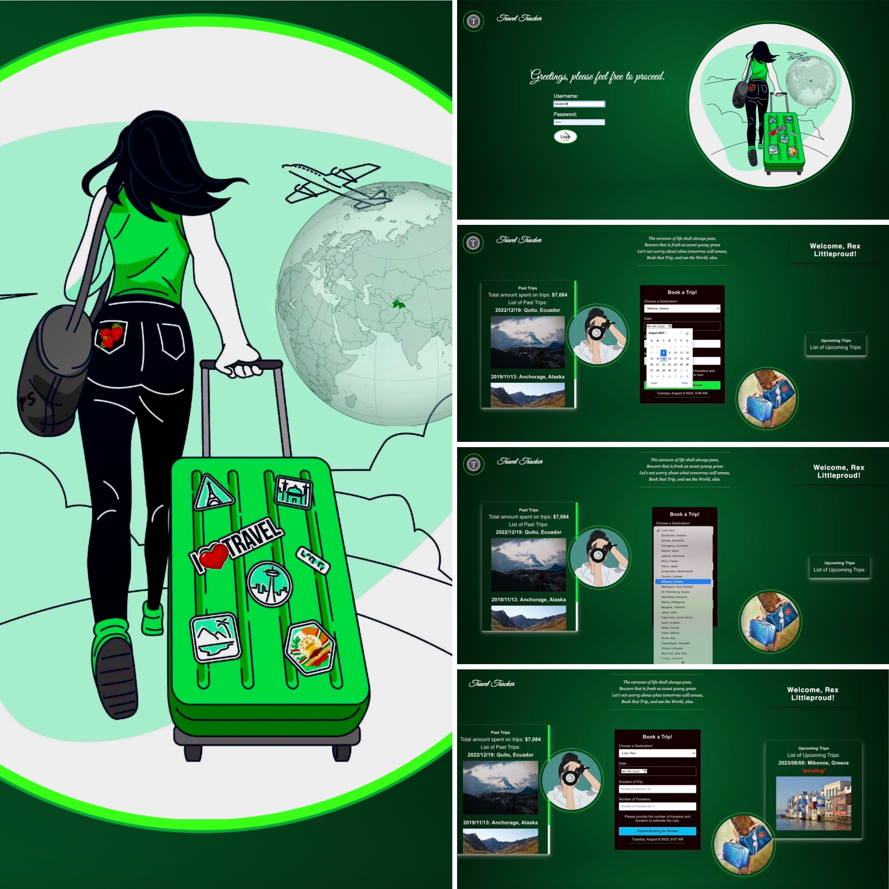

# Travel Tracker

### Abstract
Travel Dashboard serves as an intuitive interface that gives users a holistic view of their travel activities, both past and future. After authenticating with their unique credentials, users are taken to their personalized dashboard where they can review their travel history and plan new journeys with ease. The application communicates with a local server to fetch and update travel data through various API endpoints. Users can effortlessly add new trips, which are immediately reflected on the dashboard. To log in, use the credentials as follows:

- 👤 Username: `traveler<ID>` (replace `<ID>` with your user ID, e.g., `traveler50`)
- 🔒 Password: `travel`

### Setup
Fork and clone this [repo](https://github.com/Sulton88Mehron90/travel-tracker) and then in a different folder, fork and clone this [local server repo](https://github.com/turingschool-examples/travel-tracker-api).

Do the following steps for both repos. Both repos need to be running in order for the app to work correctly.

In your forked GitHub repository, click the code drop-down menu and copy the SSH key. 
Open the terminal on your machine and navigate to the containing directory you’d like - to clone the repository folder and its contents to. On the command line, run “git clone” + the SSH key you copied earlier. A new folder will be created containing a local copy of the repository linked to the forked repository you created - enter the new directory.

Install the library dependencies:

Run: ```npm install```
Next: ```npm start``` in the terminal to see the HTML page

```Control + C``` is the command to stop running the local server

### Preview of App
[](https://youtu.be/kXw2OpQBgp4)
<!-- ---
[ 

### Deployment 🛫
[Travel Tracker on Vercel](https://travel-tracker-jr3eg5hd6-sulton88mehron90.vercel.app/)
-->
### Reflections: 
I am currently in the last week of Module Two at the Turing School of Software and Design's Front End Web Development program. This program consists of four modules spanning seven months, and is focused on preparing students for a career as web developers. We work extensively with JavaScript, HTML, CSS. This is my second solo project, which I completed in 7 days, adhering to the project specifications and rubric detailed [here](https://frontend.turing.edu/projects/travel-tracker.html). 

### Technologies Used:
Javascript | Mocha & Chai | API | CSS | HTML

### Countributors:
<table>
    <tr>
        <td> Parvin A. Sattorova 
            <a href="https://www.linkedin.com/in/parvin-sattorova-edwards-357526b3/">LinkedIn</a> || 
            <a href="https://github.com/Sulton88Mehron90">GitHub</a> 
        </td>
    </tr>
    <tr>
        <td></td>
    </tr>
</table>


### Wins/Challenges:
Challenges: 
- Faced complexities while implementing the user login authentication mechanism. The challenges were primarily around extracting and validating the user ID from the input string, ensuring the ID was within an acceptable range. This required string manipulations, value validations, and DOM interactions. Addressing these intricacies provided invaluable insights into form handling in JavaScript.

Wins: 
 - Effectively fetched data from an API.
 - Successfully posted data to an API.
 - Made effective use of iterators.
 - Successfully created a login page.
 - Successfully use of DayJS.
 - Employed Test-Driven Development (TDD) methodologies throughout the project lifecycle
